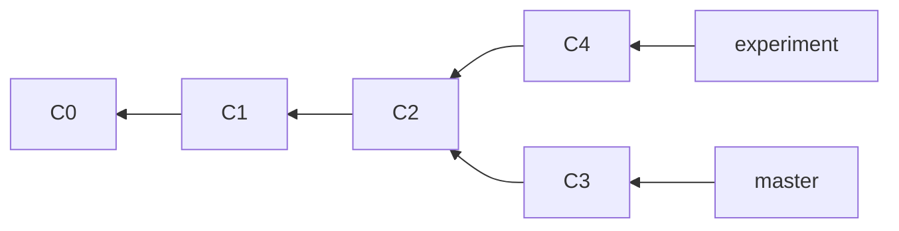
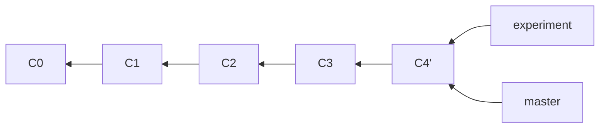
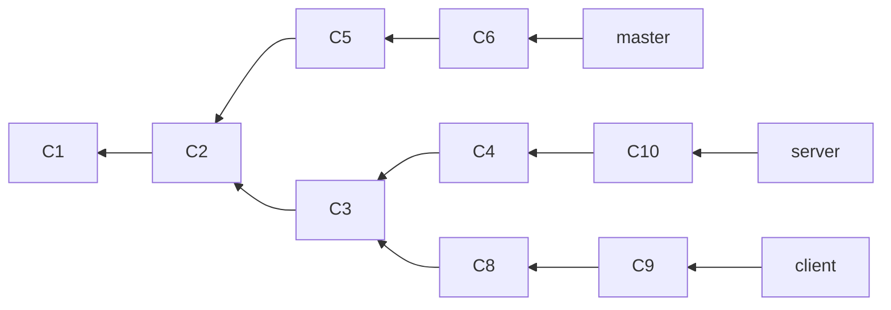
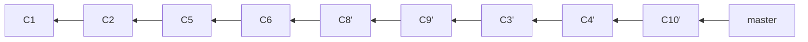

[toc]

# Getting Started

存储差异：

- 传统VCS：基于文件的delta-based
- Git：a stream of snapshots.


完整性：Git使用 SHA-1(40个字符) 算法判断文件是否有改变。Git only add data to the Git database.


三个阶段：

- Working Diretory：modified.
- Staging Area：staged.
- .git directory(Repository)：committed.


Git配置：`git config --list --show-origin`

- 全局配置：`/etc/gitconfig`  `git config --system`
- 用户配置：`~/.gitconfig` or `~/.config/git/config`  `git config --global`
- 工程配置：`.git/config`  `git config --local`

```
# 必须配置：git每次提交的时候会使用这些信息
git config --global user.name Ren-XingYu
git config --global user.email 379271608@qq

# 设置默认分支的名字: git 2.28之前使用git init创建仓库的时候，默认名称是master, 2.28之后可以修改
# git默认创建的分支是master, github 2020年将默认创建的分支从master改为main
git config --global init.defaultBranch main

# git2.27之后需要设置pull.rebase
git config --global pull.rebase "false"

# 显示配置
git config user.name

# 获取帮助信息
git helo <verb>
git <verb> --help
git <verb> -h
```

# Git Basics

## Getting a Git Repository

```
git init

git clone https://github.com/libgit2/libgit2 [alias]
```

## Recording Changes to Repository

``` <>
git status

echo aaa > README

git add README

# Show changes between commits, commit and working tree
git diff
git diff --staged

# -a : 自动进行stage(git adds)
git commit -a -m "xxx"

# 删除
git rm xxx

# 改名字
git mv file_from file_to
```

### .gitignore

```
# ignore all .a files
*.a

# but do track lib.a, even though you're ignoring .a files above
!lib.a

# only ignore the TODO file in the current directory, not subdir/TODO
/TODO

# ignore all files in any directory named build
build/

# ignore doc/notes.txt, but not doc/server/arch.txt
doc/*.txt

# ignore all .pdf files in the doc/ directory and any of its subdirectories
# **代表嵌套的目录,a/**/z 可以匹配 a/z, a/b/z, a/b/c/z
doc/**/*.pdf
```

## Viewing the Commit History

```
# -p: patch
# -2：像是2个差异
git log -p -2
git log --stat
git log --since=2.weeks
```

## Undoing Things

```
git commit --amend

# use "git restore --staged <file>..." to unstage
git restore --staged README

# use "git restore <file>..." to discard changes in working directory
git restore SECURITy

```

## Working with Remotes

```
git remote -v

# git remote add <shortname> <url>
git remote add pb https://github.com/paulboone/ticgit

# 只fetch不merge
git fetch <remote>
git fetch pb

# fetch + merge
git pull pb

# rename remote
git remote rename pb paul

# delete remote
git remote rm paul

# Inspecting a Remote
git remote show <remote>
git remote show origin

# 推送到远程仓库
git push <remote> <branch>
git push remote master
```

## Tagging

```
# 打tag
# lightweight tag：just a pointer to a specific commit
# annotated tags：stored as full objects in the git database
git tag -l

# annotated tags
git tag -a v1.4 -m "my version 1.4"

# lightweight tags
git tag v1.4-lw

# 删除tag
git tag -d v1.4-lw # 删除本地tag
git push origin --delete <tagname> 远程tag

# 基于某次提交打一个Tag
git log --pretty=oneline
git tag -a v1.2 9fceb02

# git默认不推送tag到远程仓库,需要手动推送
git push origin <tagname>
git push origin v1.4
# 全部推送
git push origin --tags

# checkout分支代码
git checkout v2.0.0
git checkout -b version2 v2.0.0
```

## Git Aliases

```
git config --global alias.ci commit

git commit -> git ci
```

# Git Branching

## Creating a New Branch

```
# 只创建分支,HEAD指针还是在原来的分支上
git branch testing

# 查看HEAD指针所在的分支
git log --oneline --decorate
```

## Switching Branches

```
# HEAD指针会移动
git checkout testing

# git log只会显示当前HEAD指针所在的分支,--all则显示所有commit信息
git log
git log --oneline --decorate --graph --all
```

## Basic Branching and Merging

```
# 创建分支请切换
git checkout -b iss53

# 合并
git merge hotfix

# 删除分支
git branch -d hotfix
```

## Branch Management

```
git branch
git branch -v
git branch --merged
git branch -d testing

# 改变分支的名字
git branch --move bad-branch-name corrected-branch-name
git push --set-upstream origin corrected-branch-name
git branch --all
git push origin --delete bad-branch-name
```

## Branching Workflows

```
主分支：master
开发分支：develop
特性分支：topic
```

## Remote Branches

```
git ls-remote <remote>
git remote show <remote>

git push <remote> <branch>

git checkout -b <branch> <remote>/<branch>

git branch -vvs

git push origin --delete serverfix
```

# Rebasing

合并分支的两种方式：

- merge：creating a new snapshot (and commit)
- rebase：take the patch of the change that was introduced in A and reapply it on top of B.

rebase的优点：makes for a cleaner history.




```
# 切换到experiment分支
git checkout experiment

# 在experiment分支上创建基于master分支的补丁
git rebase master

# 切换到master分支
git checkout master

# 合并experiment分支的补丁
git merge experiment
```







```
# Take the client branch, figure out the patches since it diverged from the server branch, and replay these patches in the client branch as if it was based directly off the master branch instead.

git rebase --onto master server client
git checkout master
git merge client

git rebase master server
git checkout master
git merge server

git branch -d client
git branch -d server
```



# Github

### create a new repository on the command line

```
echo "# Test" >> README.md
git init
git add README.md
git commit -m "first commit"
git branch -M main
git remote add origin https://github.com/Ren-XingYu/Test.git
git push -u origin main
```

### push an existing repository from the command line

```
git remote add origin https://github.com/Ren-XingYu/Test.git
git branch -M main
git push -u origin main
```

